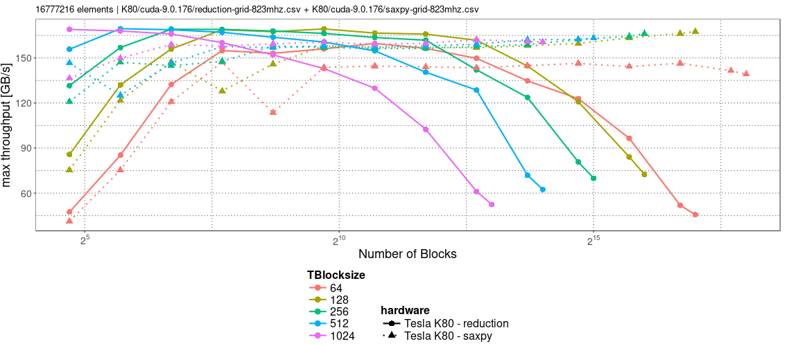

# cuda-stride-benchmark

Tests different blocksize and striding configurations on reduction and on saxpy CUDA code.

## Requirements

- cmake 3.1+
- C++11 capable compiler
- CUDA

## Build

Go to your directory (created by git clone ...):
```bash
mkdir release && cd release
cmake ..
make -j 4
```
CMake tries to find the libraries and enables the corresponding make targets.
After `make` have finished you can run e.g. `./reduction-grid`.

## Usage

If both numbers are provided, the range is processed in power of two steps.

```
./reduction-grid [START_NUMBER_OF_ELEMENTS] [END_NUMBER_OF_ELEMENTS]
```

Example:
```
./reduction-mono 32768 65536
; reduction-mono 32768 65536, Thu Mar 15 00:24:08 2018
index,dev_id,dev_name,dev_CC,dev_memClock,dev_clock,n,numSMs,blocks_i,blocks_i/numSMs,blocks_n,TBlocksize,TRuns,min_time,max_throughput
0, 0, Tesla K80, 3.7, 2505, 823, 32768, 13, 256, 19, 256, 64, 5, 0.0216 ms, 6.06815 GB/s
0, 0, Tesla K80, 3.7, 2505, 823, 32768, 13, 128, 9, 128, 128, 5, 0.022304 ms, 5.87661 GB/s
0, 0, Tesla K80, 3.7, 2505, 823, 32768, 13, 64, 4, 64, 256, 5, 0.022016 ms, 5.95349 GB/s
0, 0, Tesla K80, 3.7, 2505, 823, 32768, 13, 32, 2, 32, 512, 5, 0.022592 ms, 5.8017 GB/s
0, 0, Tesla K80, 3.7, 2505, 823, 32768, 13, 16, 1, 16, 1024, 5, 0.024864 ms, 5.27156 GB/s
0, 0, Tesla K80, 3.7, 2505, 823, 65536, 13, 512, 39, 512, 64, 5, 0.027008 ms, 9.70616 GB/s
0, 0, Tesla K80, 3.7, 2505, 823, 65536, 13, 256, 19, 256, 128, 5, 0.026496 ms, 9.89372 GB/s
0, 0, Tesla K80, 3.7, 2505, 823, 65536, 13, 128, 9, 128, 256, 5, 0.027392 ms, 9.57009 GB/s
0, 0, Tesla K80, 3.7, 2505, 823, 65536, 13, 64, 4, 64, 512, 5, 0.02736 ms, 9.58129 GB/s
0, 0, Tesla K80, 3.7, 2505, 823, 65536, 13, 32, 2, 32, 1024, 5, 0.025824 ms, 10.1512 GB/s
```

## Benchmark evaluation with rshiny



See `supplemental/rshiny` for the R scripts.

## Online R-Shiny App

[**=> Go to the online data analysis tool**!](https://www.kcod.de/cuda-stride-benchmark/)

## Local R-Shiny App

Several R libraries are required to run our r-shiny app locally.

```
ggplot2 dplyr plyr readr scales DT shiny
```
After the installation you can run:
```
R -e "shiny::runApp('./app.r')"
```
Afterwards a server is started and you can access the web application via localhost and a given port number.
Things like the port number and errors are shown in the output where the server has been launched.

Note: If you change the helper.r, a simple reload of the web application does not help. rshiny checks only app.r and recaches when app.r has been changed.
